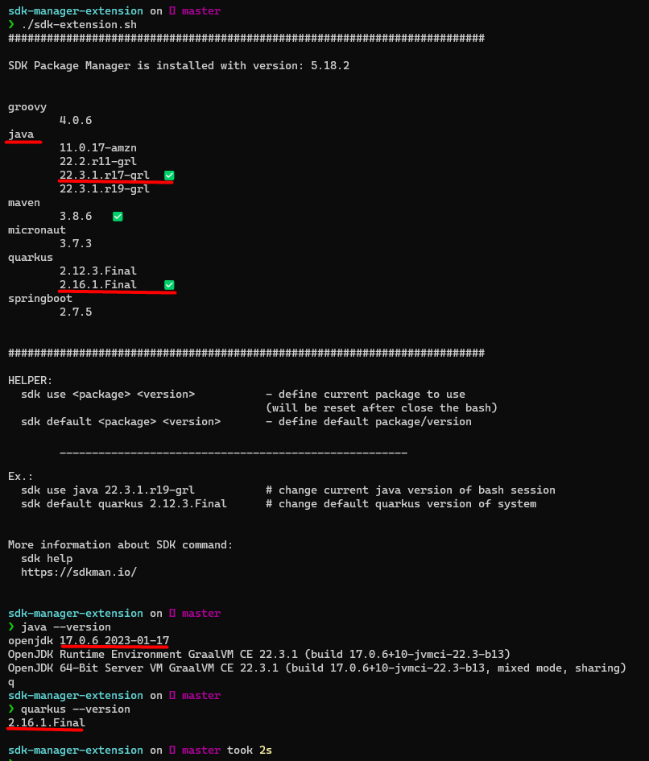
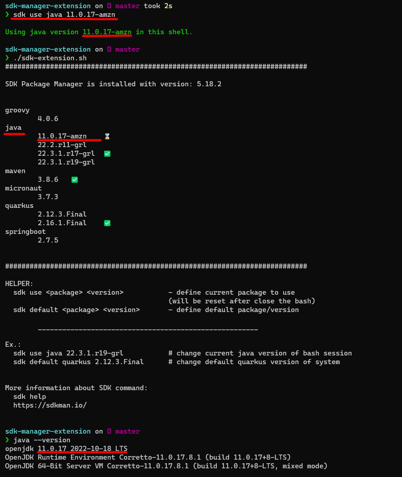
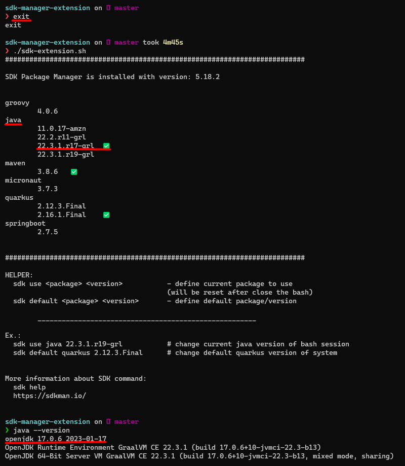

# SDK Manager Extension

SDK Manager Extension is a script that look for your installed packages with [SDK Package Manager](https://sdkman.io/) and list the installed packages and versions.
Also, allow to know which version that you are using in your current bash session.

## Purpose

I'm passion as Software Developer and I really like to work with Linux/Unix operations systems. 
Since that I discovery the [SDK Package Manager](https://sdkman.io/) I never left that tool to Manager my packages such as `Java`, `Maven`, `Quarkus`, `Spring` and etc.
As I have been worked in different projects at the same time with different stack technologies, I felt that was missing something to help me to discovery which versions of some packages that I had installed.
Then, I created that simple script that help me on my daily work and now I start sharing with all of you.

## Instalation

- Copy that script and put inside of `~/bin` directory
- Give execution permissions to that script
- Create an aliases inside of `~/.bash_aliases` with the following
  `alias sdke='~/bin/sdk-extension.sh'`
- Restart your bash session or just run the following command `source ~/.bashrc`

## Usage & Output

Initial state with default JDK version

Change current use JDK version

Go back to previous default JDK version

### Legend

✅ - The default version defined for each package

⌛ - The current use version for each package (Only if you change on your bash session)

## Reference

- [SDK Package Manager](https://sdkman.io/)
